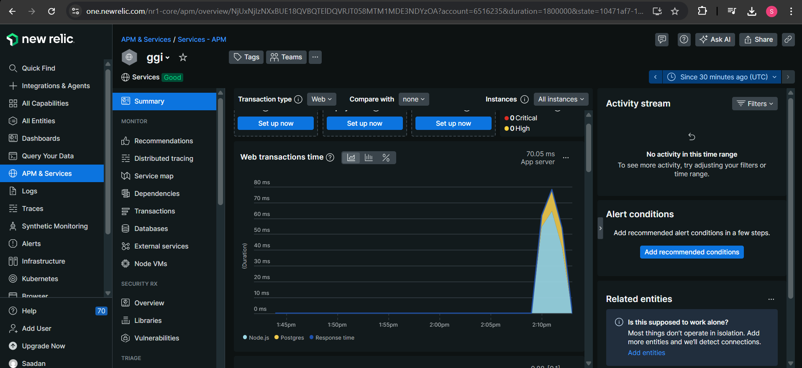

# REST Countries ETL Pipeline

## Project Overview

This project implements a complete ETL (Extract, Transform, Load) pipeline that fetches data from the REST Countries API, processes it through a sophisticated transformation layer, stores it in a PostgreSQL database, and exposes the data through a well-designed RESTful API. The implementation follows industry best practices for code organization, error handling, and performance optimization.


## Background

### The REST Countries API

The [REST Countries API](https://restcountries.com/) is a public API that provides detailed information about countries around the world. It offers comprehensive data including:

- Basic country information (name, capital, population)
- Geographical data (region, subregion, area, borders)
- Economic information (currencies)
- Cultural data (languages, flag)
- And much more

This API is widely used in applications that require country-related information, from dropdown selectors to detailed geographical analysis tools.

### Technical Assignment Context

This project was developed as part of a technical assessment to evaluate skills in:

1. **ETL Pipeline Design**: Building an efficient data pipeline that extracts data from external sources, transforms it to meet business requirements, and loads it into a database.
2. **API Development**: Creating a RESTful API with features like filtering and pagination.
3. **Project Structure**: Organizing code following clean architecture principles with separation of concerns.
4. **Best Practices**: Implementing logging, error handling, validation, and documentation.
5. **Performance Optimization**: Ensuring the application scales well and performs efficiently.

## Key Features

- **Complete ETL Pipeline**:
  - **Extract**: Fetches country data from the REST Countries API with robust error handling
  - **Transform**: Normalizes nested fields (currencies, languages), adds computed fields (population density), and cleans unnecessary data
  - **Load**: Stores processed data in PostgreSQL with an optimized schema design

- **RESTful API**:
  - Comprehensive endpoints following REST principles
  - Advanced filtering capabilities
  - Efficient pagination implementation
  - Consistent response formatting

- **Automation & Scheduling**:
  - Configurable scheduler for periodic data refreshes
  - Initial data load on application startup
  - Manual trigger endpoint for on-demand processing

- **Production-Ready Features**:
  - Comprehensive logging system
  - Performance monitoring with NewRelic
  - Error tracking with Sentry
  - Detailed documentation
  - API testing with Bruno

## Technology Stack

- **Backend**: Node.js with Express and TypeScript
- **Database**: PostgreSQL
- **ETL Scheduler**: node-cron
- **API Testing**: Bruno
- **Monitoring**: NewRelic, Sentry
- **Code Quality**: ESLint, Prettier

## Project Structure

# Project Structure

The project follows a clean, modular architecture with clear separation of concerns:

```bash
src/
├── api/               # API components
│   ├── controllers.ts # Request handlers
│   ├── routes.ts      # API route definitions
├── config/            # Configuration files
│   ├── config.ts      # App settings
├── db/                # Database components
│   ├── connection.ts  # Database connection
├── etl/               # ETL pipeline components
│   ├── extractor.ts   # Data extraction
│   ├── transformer.ts # Data transformation
│   ├── loader.ts      # Database loading
│   ├── pipeline.ts    # ETL orchestration
├── middleware/        # Express middleware
│   ├── validateRequest.ts  # Request validation middleware
├── repositories/      # Database interaction layer
│   ├── countryRepository.ts # Country-specific queries
├── scheduler/         # Scheduled tasks
│   ├── jobs.ts        # Cron job definitions
├── services/          # Business logic
│   ├── countryService.ts  # Country service layer
├── types/             # TypeScript types
│   ├── country.ts     # Country data types
├── utils/             # Utility functions
│   ├── logging/       # Logging system
│   │   ├── consoleLogger.ts # Console logger
│   │   ├── logger.ts        # Generic logger
│   ├── pagination/    # Pagination helper
│   │   ├── pagination.ts  # Pagination logic
├── validations/       # Request validation
│   ├── countryValidation.ts  # Country API validation
│   ├── etlValidation.ts      # ETL process validation
├── index.ts           # Application entry point
├── .env               # Environment variables
├── .eslintrc.js       # ESLint configuration
├── .gitignore         # Git ignored files
├── .prettierrc        # Prettier configuration
├── newrelic.cjs       # NewRelic monitoring
├── newrelic_agent.log # NewRelic logs
├── instrument.js      # Instrumentation scripts
├── tsconfig.json      # TypeScript configuration
├── package.json       # Project dependencies
├── package-lock.json  # Dependency lock file
└── README.md          # Project documentation

## ETL Pipeline Implementation

Our ETL pipeline is designed for performance, reliability, and maintainability:

### Extract

- Fetches data from the REST Countries API using axios
- Implements retry mechanisms for resilience
- Handles API rate limiting and connectivity issues
- Detailed logging for troubleshooting

### Transform

The transformation layer performs several operations:

1. **Normalization**: Flattens complex nested structures
2. **Data Enrichment**: Adds computed fields like population density
3. **Data Cleaning**: Removes unnecessary fields to optimize storage
4. **Data Validation**: Ensures data quality before loading

### Load

- Implements an efficient database schema
- Handles data upserts to avoid duplicates
- Maintains relationships between entities
- Optimized for query performance

### Scheduling

The ETL process runs:
- On application startup
- On a configurable schedule (default: daily at midnight)
- On-demand via API endpoint

## API Documentation

### Endpoints

#### Get All Countries
####GetWithPagination 
#### TestServer
#### check the ETL running server

# API Documentation 🚀

This project includes tested API collections using **Bruno**.

---
## 📌 Bruno Collection Location

All tested API collections are stored in:

```bash
collections/ggi-be-task/
├── Basic Pagination.bru
├── ByPartialName.bru
├── ByRegion.bru
├── Filter&Pagination.bru
├── Login.bru
├── OpenWeatherMap.bru
├── REST Countries.bru
├── RestCountries Node.bru
├── Signup.bru
├── SmallerPagination.bru
├── Test-Server.bru
├── bruno.json


## 📌 Tested API Endpoints

| API Name               | Description |
|------------------------|------------|
| **Basic Pagination**   | API with pagination testing |
| **ByPartialName**      | Search API by partial name |
| **ByRegion**          | Fetch countries by region |
| **Filter & Pagination** | API with filtering and pagination |
| **Login**             | User authentication API |
| **OpenWeatherMap**    | Weather API integration |
| **REST Countries**    | REST API for country data |
| **RestCountries Node** | Node.js-based country API |
| **Signup**            | User registration API |
| **Smaller Pagination** | Pagination with smaller page size |
| **Test-Server**       | Test server for various requests |

---

## 📌 How to Use the API Collection in Bruno

1. **Install Bruno**:  
   👉 [Download Bruno](https://www.usebruno.com/) and install it on your system.

2. **Import the API Collection**:  
   - Open Bruno and go to **"Import Collection"**.
   - Select the **`collections/ggi-be-task/`** folder.
   - Choose the `.bru` files.

3. **Run API Tests**:  
   - Click on any API request.
   - Adjust parameters if needed.
   - Hit **"Send"** and check the response.

---

## 📌 Bruno Collection Location
All tested API collections are stored in:
## 📌 Server & API Testing Screenshots

### **Bruno API Testing**
Here is a screenshot showing **API testing in Bruno**:


### **API Filters (By Region)**
Example of filtering **countries by region**:


### **API Filters (Partial Match)**
Search countries **using partial name filters**:


---

## 📌 APM Monitoring with New Relic
This project uses **New Relic APM** for **performance monitoring, logs, and error tracking**.

### **New Relic Dashboard**
Here is an example of the **New Relic monitoring dashboard**:



### **New Relic Traces**
Detailed **transaction tracing** for API requests:


### **New Relic Logs**
Captured logs inside **New Relic Log Monitoring**:


---

## 📌 Error Monitoring with Sentry
This backend also integrates **Sentry** for error tracking.


---

## 📌 Running the API
To start the backend API, run:
```sh
npm run dev

